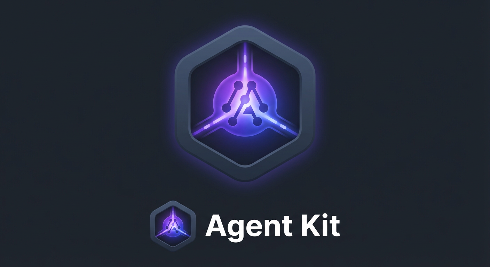
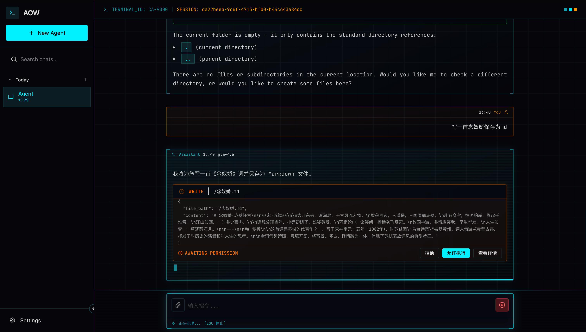
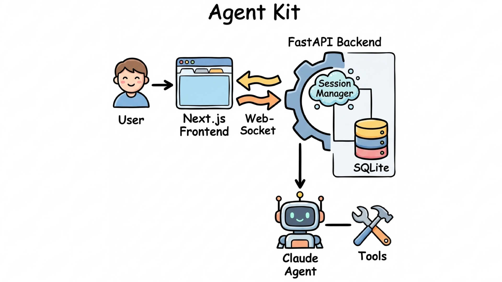

<div align="center">

<p align="center">
  <em>基于 Claude Agent SDK 构建的生产级 AI 智能体开发框架</em><br>
  <em>Production-Ready AI Agent Development Framework Powered by Claude Agent SDK</em>
</p>

[](https://opensource.org/licenses/Apache-2.0)
[](https://www.python.org/downloads/)
[](https://fastapi.tiangolo.com/)
[](https://nextjs.org/)
[](https://hub.docker.com/r/leemysw/agent-kit)


**[中文](./README-zh.md) | [English](./README.md)**

</div>

---

## 📖 简介

**Agent Kit** 是一个功能完整的 AI 智能体开发框架，集成了 **Claude Agent SDK**，提供从前端到后端的完整解决方案。该项目旨在帮助开发者快速构建、部署和扩展生产级的
AI Agent 应用。框架内置 WebSocket、Discord、Telegram 多通道接入能力，支持统一的会话路由与消息处理。

<div align="center">


</div>

### ✨ 核心特性

<table>
<tr>
<td width="33%" valign="top">

#### 🚀 高性能架构

- FastAPI 异步后端
- Next.js 前端框架
- WebSocket 实时通信
- Discord / Telegram 第三方 IM 接入
- SQLite + Alembic 数据库迁移

</td>
<td width="33%" valign="top">

#### 🎯 完整的 AI 集成

- Claude Agent SDK 深度集成
- 流式响应模式
- 跨通道统一会话路由
- 自定义工具系统 (开发中)
- MCP 支持 (开发中)
- Skill 支持 (开发中)

</td>
<td width="33%" valign="top">

#### 🛠️ 开发者友好

- TypeScript 类型安全
- Zustand 状态管理
- 完整的会话管理
- 丰富的文档支持

</td>
</tr>
</table>

---

## 🏗️ 架构设计

<div align="center">

</div>

---

## 📋 目录

- [简介](#-简介)
- [架构设计](#-架构设计)
- [快速开始](#-快速开始)
- [项目结构](#-项目结构)
- [核心功能](#-核心功能)
- [配置说明](#-配置说明)
- [第三方 IM 集成](#-第三方-im-集成)
- [API 文档](#-api-文档)
- [开发指南](#-开发指南)
- [贡献指南](#-贡献指南)
- [许可证](#-许可证)

---

## 🚀 快速开始

### 前置要求

- **Python**: 3.11 或更高版本
- **Node.js**: 24.0 或更高版本
- **Docker & Docker Compose**: 最新版本
- **Agent API Key**: 从 [Anthropic](https://console.anthropic.com/) 获取 🤔 [Bigmodel](https://open.bigmodel.cn/) 获取

### 安装步骤

#### 方式一：Docker 部署（推荐）

**1️⃣ 克隆项目**

```bash
git clone https://github.com/leemysw/agent-kit.git
cd agent-kit
```

**2️⃣ 配置环境变量**

```bash
# 复制环境变量模板
cp example.env .env
# 编辑 .env 文件，添加你的 API 密钥
```

**3️⃣ 启动服务**

```bash
make start

╰─ make start
TAG=0.1.2 docker compose -f deploy/docker-compose.yml up -d
[+] Running 3/3
 ✔ Container deploy-agent-kit-1  Started                                                                                                                                           1.8s 
 ✔ Container deploy-web-1   Started                                                                                                                                           0.9s 
 ✔ Container deploy-nginx-1      Running                                                                                                                                           0.0s 

✅ Agent Kit is running!
🌐 Web UI: http://localhost
📚 API Docs: http://localhost/agent/docs
📋 Logs: run 'make logs' to view service logs
```

**4️⃣ 访问应用**

- 应用地址: [http://localhost](http://localhost)

---

#### 方式二：本地开发

**1️⃣ 克隆项目**

```bash
git clone https://github.com/leemysw/agent-kit.git
cd agent-kit
```

**2️⃣ 后端设置**

```bash
# 安装 Python 依赖
pip install -r agent/requirements.txt

# 配置环境变量
cp example.env .env
# 编辑 .env 文件，添加你的 API 密钥
```

**配置 `.env` 文件：**

```env
# Claude API 配置
ANTHROPIC_API_KEY=your_api_key_here
ANTHROPIC_BASE_URL=https://api.anthropic.com or https://open.bigmodel.cn/api/anthropic
ANTHROPIC_MODEL=claude-3-5-sonnet-20241022 or glm-5

# 服务器配置
HOST=0.0.0.0
PORT=8010
DEBUG=true
WORKERS=1
```

**初始化数据库：**

```bash
# 运行数据库迁移，创建数据表
alembic upgrade head
```

**3️⃣ 前端设置**

```bash
cd web

# 安装依赖
npm install

# 配置环境变量
cp example.env .env.local
# 编辑 .env.local 文件
```

**配置 `.env.local` 文件：**

```env
# 开发环境配置
NEXT_PUBLIC_API_URL=http://localhost:8010/agent/v1
NEXT_PUBLIC_WS_URL=ws://localhost:8010/agent/v1/chat/ws
NEXT_PUBLIC_DEFAULT_CWD=/opt/app/playground
NEXT_PUBLIC_DEFAULT_MODEL=glm-5
```

**4️⃣ 运行项目**

```bash
# 启动后端（在项目根目录）
python main.py

# 启动前端（在 web 目录）
npm run dev
```

**5️⃣ 访问应用**

- 应用地址: [http://localhost:3000](http://localhost:3000)

---

## 📁 项目结构

```
agent-kit/
├── agent/                         # 后端服务
│   ├── api/                       # API 路由
│   ├── core/                      # 核心配置
│   ├── service/                   # 业务逻辑
│   │   ├── websocket_handler.py   # WebSocket 处理
│   │   └── session_manager.py     # 会话管理
│   ├── shared/                    # 共享模块
│   └── utils/                     # 工具函数
├── web/                           # 前端应用
│   ├── src/
│   │   ├── app/                   # Next.js 页面
│   │   ├── components/            # React 组件
│   │   ├── hooks/                 # 自定义 Hooks
│   │   ├── lib/                   # 工具库
│   │   ├── store/                 # Zustand 状态管理
│   │   └── types/                 # TypeScript 类型
├── alembic/                       # 数据库迁移
├── deploy/                        # 部署相关
├── docs/                          # 文档
│   ├── websocket-session-flow.md  # WebSocket 流程
│   └── guides/                    # Cluade Agent SDK详细指南
├── main.py                        # 应用入口
└── README.md                      # 本文件
```

---

## 🎯 核心功能

### 1. 实时对话系统

- ✅ WebSocket 实时通信
- ✅ 流式响应支持
- ✅ 会话持久化
- ✅ 消息历史管理

### 2. 智能会话管理

- ✅ 多会话支持
- ✅ 会话搜索和筛选

### 3. 强大的 AI 能力

- ✅ Claude Agent SDK 集成
- ❌ 自定义工具调用（开发中）
- ❌ Slash 命令系统（开发中）
- ❌ Skills 技能系统（开发中）
- ❌ MCP 协议支持（开发中）

### 4. 权限与安全

- ✅ 细粒度工具权限控制
- ✅ 用户确认机制

---

## ⚙️ 基础配置说明

### 后端配置项

| 配置项                  | 说明            | 默认值                         |
|----------------------|---------------|-----------------------------|
| `ANTHROPIC_API_KEY`  | Claude API 密钥 | -                           |
| `ANTHROPIC_BASE_URL` | API 基础 URL    | `https://api.anthropic.com` |
| `ANTHROPIC_MODEL`    | 使用的模型         | `glm-5`                   |
| `HOST`               | 服务器主机         | `0.0.0.0`                   |
| `PORT`               | 服务器端口         | `8010`                      |
| `DEBUG`              | 调试模式          | `false`                     |
| `WORKERS`            | 工作进程数         | `1`                         |

### 前端配置项

| 配置项                         | 说明           | 默认值                                    |
|-----------------------------|--------------|----------------------------------------|
| `NEXT_PUBLIC_API_URL`       | 后端 API 地址    | `http://localhost:8010/agent/v1`       |
| `NEXT_PUBLIC_WS_URL`        | WebSocket 地址 | `ws://localhost:8010/agent/v1/chat/ws` |
| `NEXT_PUBLIC_DEFAULT_CWD`   | 工作目录         | `/opt/app/playground`                  |
| `NEXT_PUBLIC_DEFAULT_MODEL` | 默认模型         | `glm-5`                              |

---

## 🔌 第三方 IM 集成

当前后端支持 3 类消息入口：
- `WebSocket`（Web 前端）
- `Discord`（`agent/service/channel/discord_channel.py`）
- `Telegram`（`agent/service/channel/telegram_channel.py`）

### 1) 配置环境变量（`.env`）

```env
# Discord
DISCORD_ENABLED=true
DISCORD_BOT_TOKEN=your_discord_bot_token
DISCORD_ALLOWED_GUILDS=123456789012345678,987654321098765432
DISCORD_TRIGGER_WORD=@agent-kit

# Telegram
TELEGRAM_ENABLED=true
TELEGRAM_BOT_TOKEN=your_telegram_bot_token
TELEGRAM_ALLOWED_USERS=12345678,87654321
```

应用启动时会根据 `DISCORD_ENABLED/TELEGRAM_ENABLED` 自动注册并启动对应通道。

### 2) 会话路由规则

第三方 IM 使用统一 session key 格式：

```text
agent:<agentId>:<channel>:<chatType>:<ref>[:topic:<threadId>]
```

示例：
- Discord 群聊：`agent:main:dg:group:<guild_id>:<channel_id>`
- Telegram 私聊：`agent:main:tg:dm:<user_id>`

### 3) 常见问题

- Discord 不响应：确认 Bot 已开启 **Message Content Intent**。
- Telegram 无法收消息：确认 Bot 不是 privacy mode 限制场景，且 `TELEGRAM_ALLOWED_USERS` 已包含当前用户 ID。
- `DISCORD_TRIGGER_WORD`：当前实现会移除触发词，但不会强制要求消息必须包含触发词。

---

## 📖 欢迎所有形式的贡献！


### 问题反馈

如果你发现了 bug 或有新的功能建议，请通过 [GitHub Issues](https://github.com/leemysw/agent-kit/issues) 提交。

---

## 📄 许可证

本项目采用 Apache License 2.0 许可证 - 详情请查看 [LICENSE](LICENSE) 文件

---

## 🙏 致谢

- [Claude Agent SDK](https://docs.anthropic.com/en/docs/agent-sdk) - 核心 AI 框架

---

<div align="center">

### Made with ❤️ by [leemysw](https://github.com/leemysw)

**如果这个项目对你有帮助，请给它一个 ⭐️ Star！**

</div>

---
