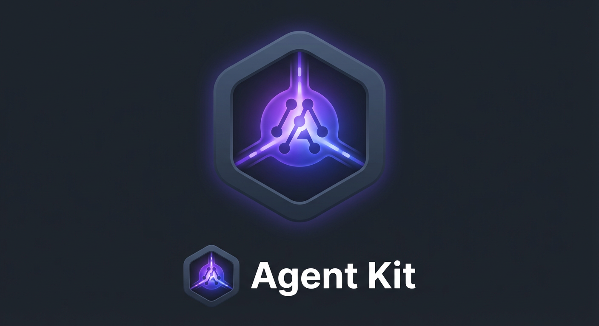
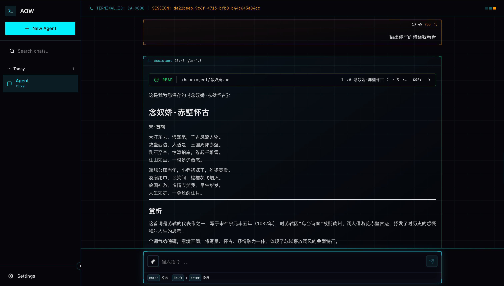
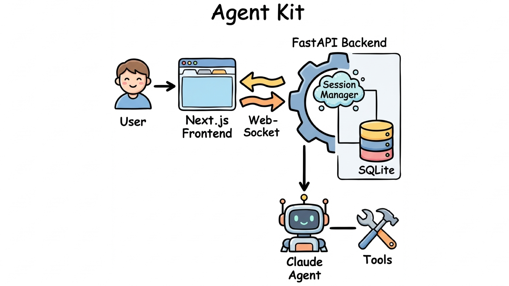

<div align="center">

<p align="center">
  <em>Production-Ready AI Agent Development Framework Powered by Claude Agent SDK</em><br>
  <em>基于 Claude Agent SDK 构建的生产级 AI 智能体开发框架</em>
</p>

[](https://opensource.org/licenses/Apache-2.0)
[](https://www.python.org/downloads/)
[](https://fastapi.tiangolo.com/)
[](https://nextjs.org/)
[](https://hub.docker.com/r/leemysw/agent-kit)

**[English](./README.md) | [中文](./README-zh.md)**

</div>

---

## 📖 Introduction

**Agent Kit** is a comprehensive AI agent development framework that integrates **Claude Agent SDK**, providing a complete solution from frontend to backend. This project aims to help developers quickly build, deploy, and scale production-grade AI Agent applications.

<div align="center">


</div>

### ✨ Core Features

<table>
<tr>
<td width="33%" valign="top">

#### 🚀 High-Performance Architecture

- FastAPI asynchronous backend
- Next.js frontend framework
- WebSocket real-time communication
- SQLite + Alembic database migrations

</td>
<td width="33%" valign="top">

#### 🎯 Complete AI Integration

- Deep Claude Agent SDK integration
- Streaming response support
- Custom tools system (in development)
- MCP support (in development)
- Skill support (in development)

</td>
<td width="33%" valign="top">

#### 🛠️ Developer Friendly

- TypeScript type safety
- Zustand state management
- Complete session management
- Comprehensive documentation

</td>
</tr>
</table>

---

## 🏗️ Architecture

<div align="center">

</div>

---

## 📋 Table of Contents

- [Introduction](#-introduction)
- [Architecture](#-architecture)
- [Quick Start](#-quick-start)
- [Project Structure](#-project-structure)
- [Core Features](#-core-features)
- [Configuration](#-configuration)
- [API Documentation](#-api-documentation)
- [Development Guide](#-development-guide)
- [Contributing](#-contributing)
- [License](#-license)

---

## 🚀 Quick Start

### Prerequisites

- **Python**: 3.11 or higher
- **Node.js**: 24.0 or higher
- **Docker & Docker Compose**: Latest version
- **Agent API Key**: Get from [Anthropic](https://console.anthropic.com/) or [Bigmodel](https://open.bigmodel.cn/)

### Installation

#### Option 1: Docker Deployment (Recommended)

**1️⃣ Clone the repository**

```bash
git clone https://github.com/leemysw/agent-kit.git
cd agent-kit
```

**2️⃣ Configure environment variables**

```bash
# Copy environment variable template
cp example.env .env
# Edit .env file and add your API key
```

**3️⃣ Start services**

```bash
make start
╰─ make start
TAG=0.1.2 docker compose -f deploy/docker-compose.yml up -d
[+] Running 3/3
 ✔ Container deploy-agent-kit-1  Started                                                                                                                                           1.8s 
 ✔ Container deploy-web-1   Started                                                                                                                                           0.9s 
 ✔ Container deploy-nginx-1      Running                                                                                                                                           0.0s 

✅ Agent Kit is running!
🌐 Web UI: http://localhost
📋 Logs: run 'make logs' to view service logs
```

**4️⃣ Access the application**

- Application URL: [http://localhost](http://localhost)

---

#### Option 2: Local Development

**1️⃣ Clone the repository**

```bash
git clone https://github.com/leemysw/agent-kit.git
cd agent-kit
```

**2️⃣ Backend setup**

```bash
# Install Python dependencies
pip install -r agent/requirements.txt

# Configure environment variables
cp example.env .env
# Edit .env file and add your API key
```

**Configure `.env` file:**

```env
# Claude API configuration
ANTHROPIC_API_KEY=your_api_key_here
ANTHROPIC_BASE_URL=https://api.anthropic.com or https://open.bigmodel.cn/api/anthropic
ANTHROPIC_MODEL=claude-3-5-sonnet-20241022 or glm-4.7

# Server configuration
HOST=0.0.0.0
PORT=8010
DEBUG=true
WORKERS=1
```

**3️⃣ Frontend setup**

```bash
cd web

# Install dependencies
npm install

# Configure environment variables
cp example.env .env.local
# Edit .env.local file
```

**Configure `.env.local` file:**

```env
# Development environment configuration
NEXT_PUBLIC_API_URL=http://localhost:8010/agent/v1
NEXT_PUBLIC_WS_URL=ws://localhost:8010/agent/v1/chat/ws
NEXT_PUBLIC_DEFAULT_CWD=/opt/app/playground
NEXT_PUBLIC_DEFAULT_MODEL=glm-4.7
```

**4️⃣ Run the project**

```bash
# Start backend (in project root directory)
python main.py

# Start frontend (in web directory)
npm run dev
```

**5️⃣ Access the application**

- Application URL: [http://localhost:3000](http://localhost:3000)

---

## 📁 Project Structure

```
agent-kit/
├── agent/                         # Backend service
│   ├── api/                       # API routes
│   ├── core/                      # Core configuration
│   ├── service/                   # Business logic
│   │   ├── websocket_handler.py   # WebSocket handler
│   │   └── session_manager.py     # Session management
│   ├── shared/                    # Shared modules
│   └── utils/                     # Utility functions
├── web/                           # Frontend application
│   ├── src/
│   │   ├── app/                   # Next.js pages
│   │   ├── components/            # React components
│   │   ├── hooks/                 # Custom Hooks
│   │   ├── lib/                   # Utility library
│   │   ├── store/                 # Zustand state management
│   │   └── types/                 # TypeScript types
├── alembic/                       # Database migrations
├── deploy/                        # Deployment files
├── docs/                          # Documentation
│   ├── websocket-session-flow.md  # WebSocket flow
│   └── guides/                    # Claude Agent SDK guides
├── main.py                        # Application entry point
└── README.md                      # This file
```

---

## 🎯 Core Features

### 1. Real-time Conversation System

- ✅ WebSocket real-time communication
- ✅ Streaming response support
- ✅ Session persistence
- ✅ Message history management

### 2. Intelligent Session Management

- ✅ Multi-session support
- ✅ Session search and filtering

### 3. Powerful AI Capabilities

- ✅ Claude Agent SDK integration
- ❌ Custom tool calling (in development)
- ❌ Slash command system (in development)
- ❌ Skills system (in development)
- ❌ MCP protocol support (in development)

### 4. Permissions & Security

- ✅ Fine-grained tool permission control
- ✅ User confirmation mechanism

---

## ⚙️ Configuration

### Backend Configuration

| Config Item | Description | Default Value |
|------------|------------|--------------|
| `ANTHROPIC_API_KEY` | Claude API key | - |
| `ANTHROPIC_BASE_URL` | API base URL | `https://api.anthropic.com` |
| `ANTHROPIC_MODEL` | Model to use | `glm-4.7` |
| `HOST` | Server host | `0.0.0.0` |
| `PORT` | Server port | `8010` |
| `DEBUG` | Debug mode | `false` |
| `WORKERS` | Number of workers | `1` |

### Frontend Configuration

| Config Item | Description | Default Value |
|------------|------------|--------------|
| `NEXT_PUBLIC_API_URL` | Backend API URL | `http://localhost:8010/agent/v1` |
| `NEXT_PUBLIC_WS_URL` | WebSocket URL | `ws://localhost:8010/agent/v1/chat/ws` |
| `NEXT_PUBLIC_DEFAULT_CWD` | Working directory | `/opt/app/playground` |
| `NEXT_PUBLIC_DEFAULT_MODEL` | Default model | `glm-4.7` |

---

## 📚 Documentation

For detailed guides and API documentation, please visit:

- **[Frontend API Documentation](web/README.md)** - React components, types, and API interfaces
- **[WebSocket Session Flow](docs/websocket-session-flow.md)** - WebSocket session and data flow
- **[Guides](docs/guides/)** - Comprehensive guides for various features

### Development Guides

- **[Session Management](docs/guides/sessions.md)** - Session creation, management, and message handling
- **[Streaming vs Single Mode](docs/guides/streaming-vs-single-mode.md)** - AI response mode comparison
- **[Custom Tools](docs/guides/custom-tools.md)** - Creating and using custom AI tools
- **[Slash Commands](docs/guides/slash-commands.md)** - Custom slash command development
- **[Skills Guide](docs/guides/skills.md)** - Skill system usage and development
- **[MCP Integration](docs/guides/mcp.md)** - Model Context Protocol integration
- **[Hosting Guide](docs/guides/hosting.md)** - Production deployment and configuration
- **[Permissions Management](docs/guides/permissions.md)** - Permission control and security settings

---

## 🤝 Contributing

All forms of contributions are welcome!

### Bug Reports & Feature Requests

If you find a bug or have a new feature suggestion, please submit it through [GitHub Issues](https://github.com/leemysw/agent-kit/issues).

---

## 📄 License

This project is licensed under the Apache License 2.0 - see the [LICENSE](LICENSE) file for details.

---

## 🙏 Acknowledgments

- [Claude Agent SDK](https://docs.anthropic.com/en/docs/agent-sdk) - Core AI framework

---

<div align="center">

### Made with ❤️ by [leemysw](https://github.com/leemysw)

**If this project helps you, please give it a ⭐️ Star!**

</div>

---