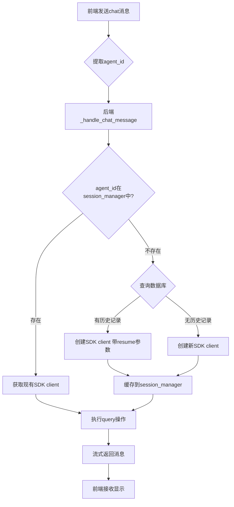
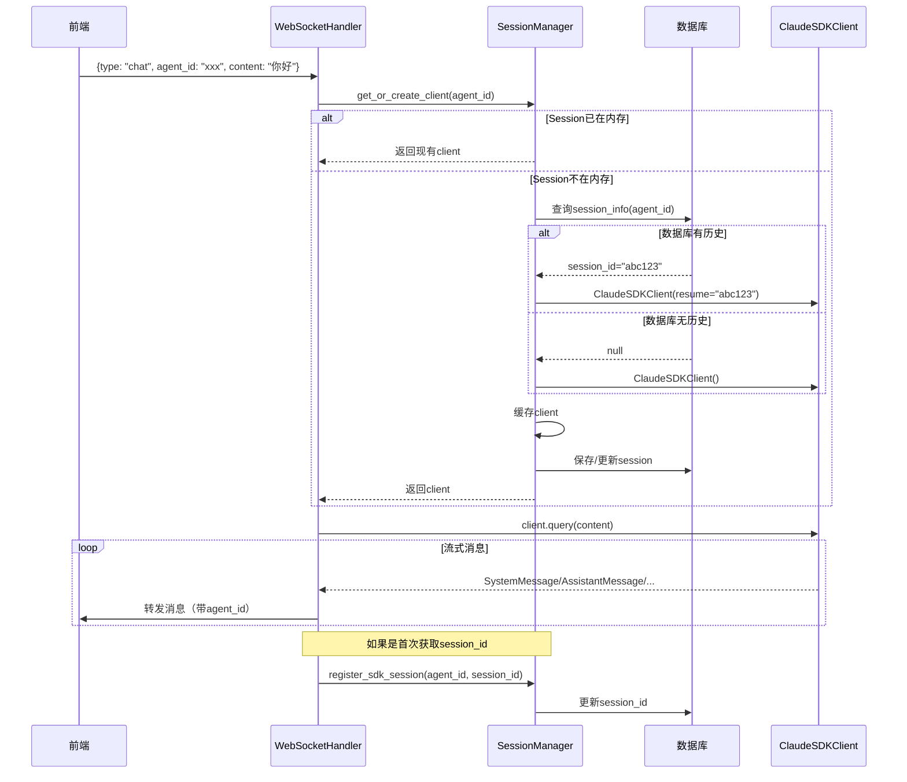
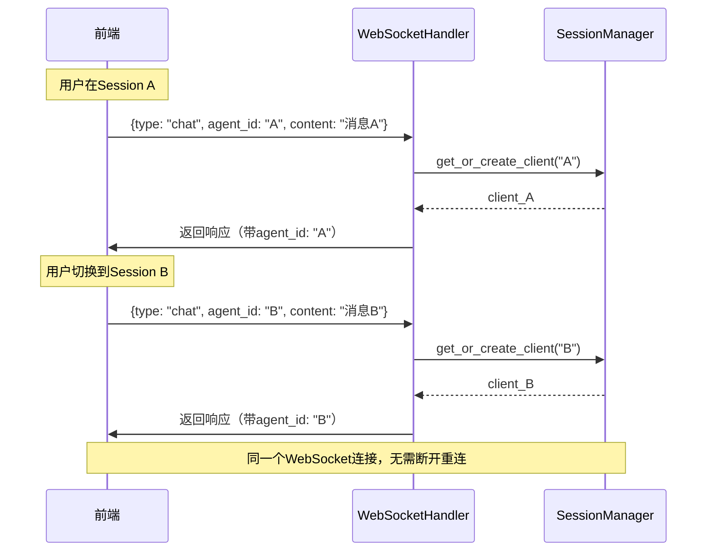
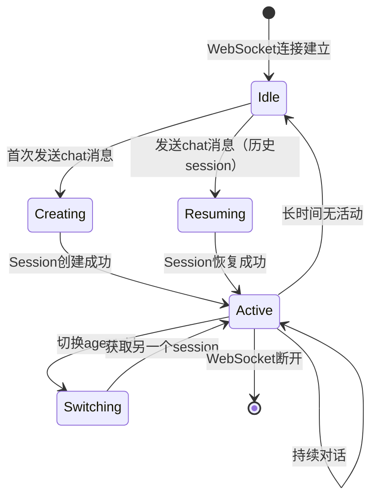

# WebSocket 会话管理流程设计

## 设计理念

**核心思想**：按需创建（Lazy Loading），消息驱动（Message Driven）

- ✅ 所有会话操作由 `chat` 消息触发
- ✅ 后端自动判断新建/恢复session
- ✅ 单一WebSocket连接处理多个session


## 核心流程

### 1. 整体流程图



### 2. 详细时序图



### 3. Session切换流程



## 消息协议

### 前端发送消息

```typescript
// Chat消息（唯一的消息类型）
{
    type: "chat",
    agent_id: string,      // 必填
    content: string,      // 必填
    options?: {           // 可选
        model?: string,
        // ... 其他配置
    }
}

// 中断消息
{
    type: "interrupt",
    agent_id: string
}

// 心跳
{
    type: "ping"
}
```

### 后端返回消息

所有消息都包含`agent_id`和`session_id`：

```python
{
    "message_type": "assistant",
    "agent_id": "xxx",           # 前端会话ID
    "session_id": "yyy",        # SDK会话ID
    "message": {...},
    "timestamp": "..."
}
```

## Session生命周期


